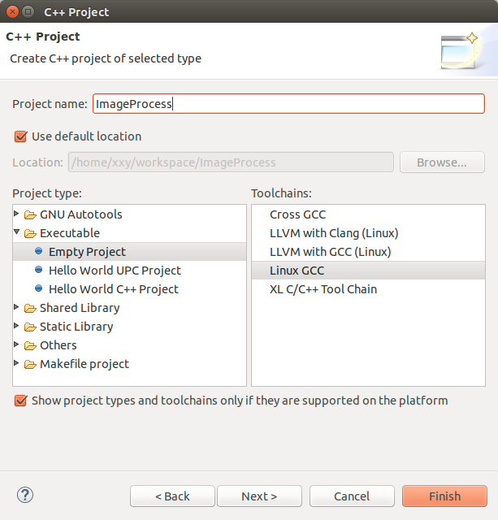
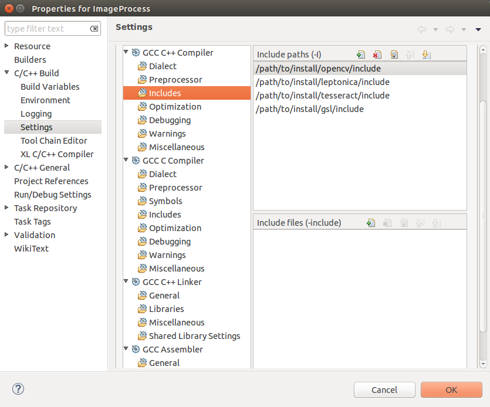
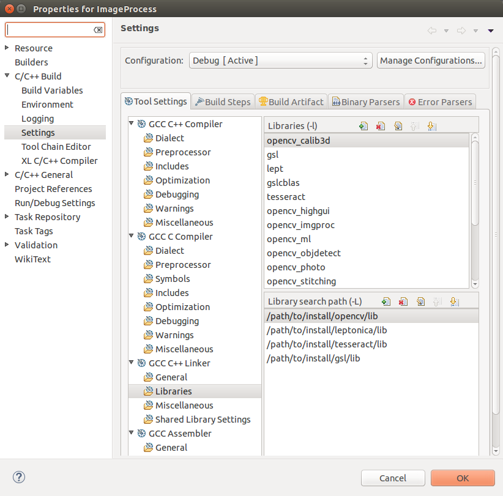

# OCRus OCR Core

## Overview
This is the OCRus back-end part that preprocess the image and do OCR. 

## How to configure and develop

### 1. Step: Install OpenCV
Download and install [OpenCV](http://docs.opencv.org/3.0-last-rst/doc/tutorials/introduction/linux_install/linux_install.html).

* Currently we use OpenCV 2.4.10 because the greater version has some compile issues in Windows.

### 2. Step: Install Tesseract
If they are not already installed, you need the following libraries (Ubuntu):

```
sudo apt-get install autoconf automake libtool
sudo apt-get install libpng12-dev
sudo apt-get install libjpeg62-dev
sudo apt-get install libtiff4-dev
sudo apt-get install zlib1g-dev
```

Download [Leptonica 1.72](http://www.leptonica.org/download.html).

Run following commands to install Leptonica:

```
tar -xzvf leptonica-1.72.tar.gz
cd leptonica-1.72
./configure --prefix=/path/to/install/leptonica
make
make install (use `sudo make install` if `/path/to/install/leptonica directory` has permission limits)
```
Download [Tesseract 3.02.02](https://code.google.com/p/tesseract-ocr/downloads/detail?name=tesseract-ocr-3.02.02.tar.gz&can=2&q=)　source code.

Run following commands to install Tesseract:

```
./autogen.sh
LIBLEPT_HEADERSDIR=/path/to/install/leptonica/include ./configure --prefix=/path/to/install/tesseract --with-extra-libraries=/path/to/install/leptonica/lib
make
make install (use `sudo make install` if /path/to/install/leptonica directory has permission limits)
```

Create a file `/etc/ld.so.conf.d/tesseract.conf` and add these two lines into the file:

```
/path/to/install/tesseract/lib
/path/to/install/leptonica/lib
```

Run following command to link shared libraries:

```
sudo ldconfig -v
```

### 3. Step: Add Language Training Data
Download [English](https://code.google.com/p/tesseract-ocr/downloads/detail?name=tesseract-ocr-3.02.eng.tar.gz&can=2&q=), [Japanese](https://code.google.com/p/tesseract-ocr/downloads/detail?name=tesseract-ocr-3.02.jpn.tar.gz&can=2&q=), [Chinese](https://code.google.com/p/tesseract-ocr/downloads/detail?name=tesseract-ocr-3.02.chi_sim.tar.gz&can=2&q=) language trained data. Uncompress these 3 files.

Put the `eng.traineddata`, `jpn.traineddata`, `chi_sim.traineddata` to directory `/path/to/install/tesseract/share/tessdata/`.

Run following command to add `TESSDATA_PREFIX` variable to your environment variables.

```
export TESSDATA_PREFIX=/path/to/install/tesseract/share/
```

* NOTE: Language data are in `/path/to/install/tesseract/share/tessdata/`, but `TESSDATA_PREFIX` is `/path/to/install/tesseract/share/`, no `tessdata`.

* If you want to use other language, please [download](https://code.google.com/p/tesseract-ocr/downloads/list) the corresponding trained data and put the `*.traineddata` to the above directory.

### 4. Step: Install Eclipse IDE for C/C++ Developers, Download the Source Code and Make it Run
Download [Eclipse IDE for C/C++ Developers](http://www.eclipse.org/downloads/packages/eclipse-ide-cc-developers/heliossr2).

1. Start Eclipse. Just run the executable that comes in the folder.
2. Go to **File -> New -> C/C++ Project**
3. Choose a name for your project (i.e. `ImageProcess`). An Empty Project should be okay.
    
4. Leave everything else by default. Press Finish.
5. Git clone this project or download the zip file, extract all the file into this project root directory.
6. Add OpenCV, Tesseract, GSL header files and libraries to the project. Do the following:
 + Go to **Project–>Properties**
 + In **C/C++ Build**, click on **Settings**.
 + In **GCC C++ Compiler**, go to **Includes**. In **Include paths(-l)** you should include the path of the folder where OpenCV, Leptonica, Tesseract, GSL were installed:
    
 + In **GCC C++ Linker**, go to **Libraries**. In **Library search path (-L)** you should write the path to where the OpenCV, Leptonica, Tesseract, GSL libraries reside:
    
 
 
 


Git clone this project and run the following commands:

```
cd ocrus-pc-wrapper
mvn clean package
```

Then you can find `ocrus-java-wrapper-0.0.1-SNAPSHOT-jar-with-dependencies.jar` in `target/` directory.

You can run following command to do OCR by using a GUI:

```
java -jar target/ocrus-java-wrapper-0.0.1-SNAPSHOT-jar-with-dependencies.jar -u
```

The GUI looks like this:


You can specify the OCR mode(single image or a directory), input path, output directory, OCR language, and then click `Run OCR` to check the result.

Or, you can run following command to do OCR by using command line:

```
java -jar target/ocrus-java-wrapper-0.0.1-SNAPSHOT-jar-with-dependencies.jar -i input_path -o output_dir [OPTIONS]
```

OPTIONS explanation:

* -h	Print help for Tesseract Java Wrapper
* -s	Single image mode(Default)
* -d	Directory mode
* -l	OCR language(Default is English)
* -i	Input file or input directory (depends on mode). NECESSARY!
* -o	OCR result output directory. NECESSARY!

For example, if you want to do OCR for an image `img.jpg`, the OCR output directory is `ocr-output`, the OCR language is `jpn`, the you can run the following command:

```
java -jar target/ocrus-java-wrapper-0.0.1-SNAPSHOT-jar-with-dependencies.jar -s -i img.jpg -o ocr-output -l jpn
```

After OCR, you can open `ocr-output/img.txt` to check the ocr result.

Another example, if you want to do OCR for all images in directory `imgs`, the OCR output directory is `ocr-output`, the OCR language is `eng`, the you can run the following command:

```
java -jar target/ocrus-java-wrapper-0.0.1-SNAPSHOT-jar-with-dependencies.jar -d -i imgs -o ocr-output -l eng
```

After OCR, you can open `ocr-output/*.txt` to check the corresponding ocr result for different image.

## Q&A
* Why does the command line throw "Error opening data file ..." exception?
>
>The language trained data is not put in the correct directory.
>
>Please put the `.traineddata` file into the tessdata directory that required by the command line tips.
>

* Why is the GUI not working by throw "Headless" exception?
>
>The Java version doesn't include graphics library.
>
>Please make sure the Java version is Oracle 1.7 or higher.
>